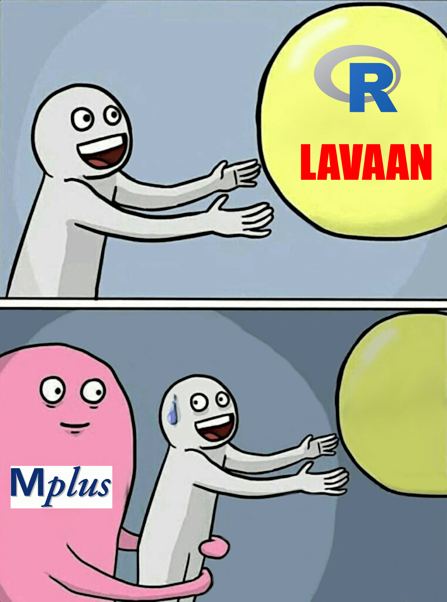
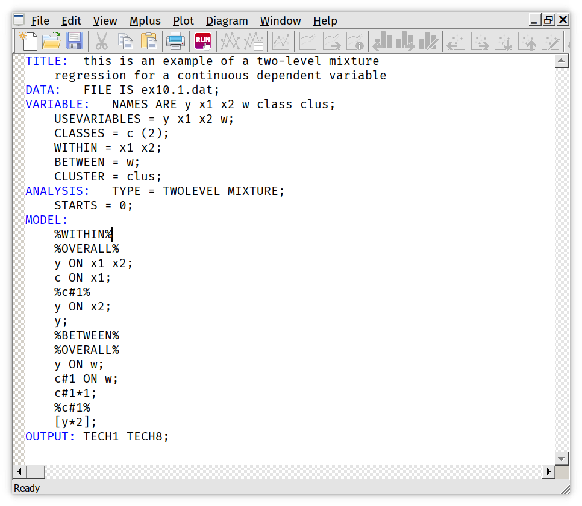
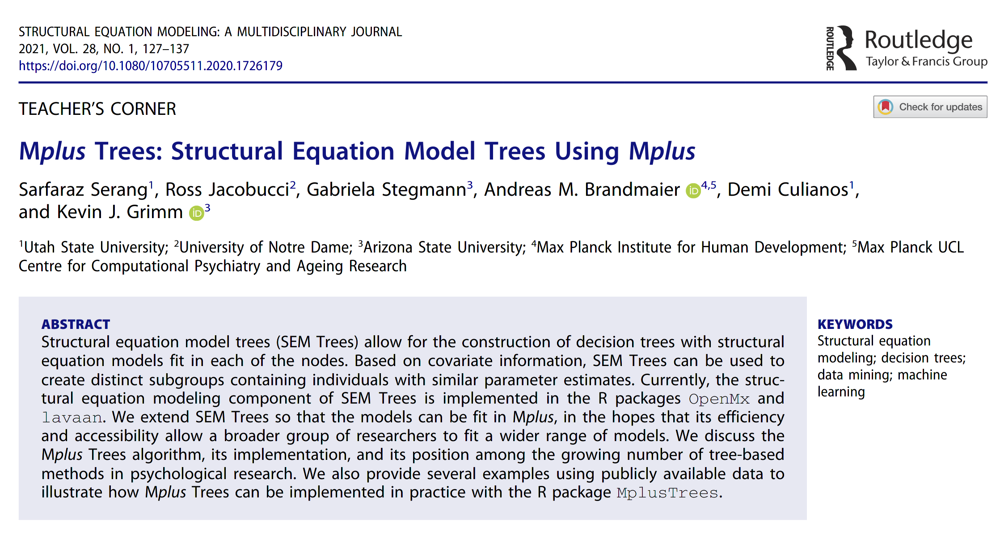
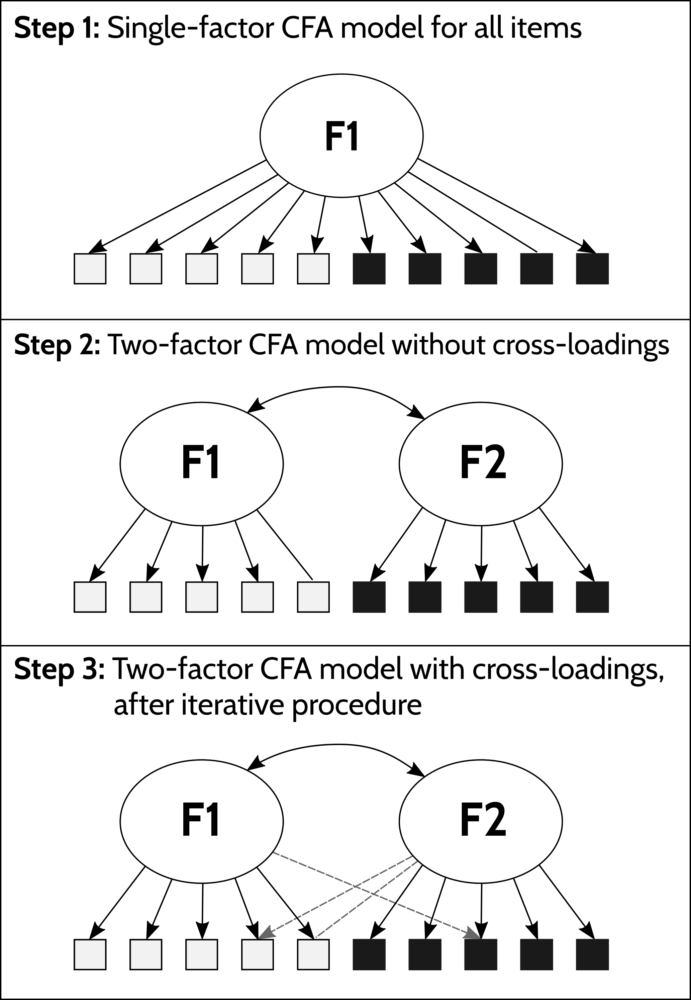
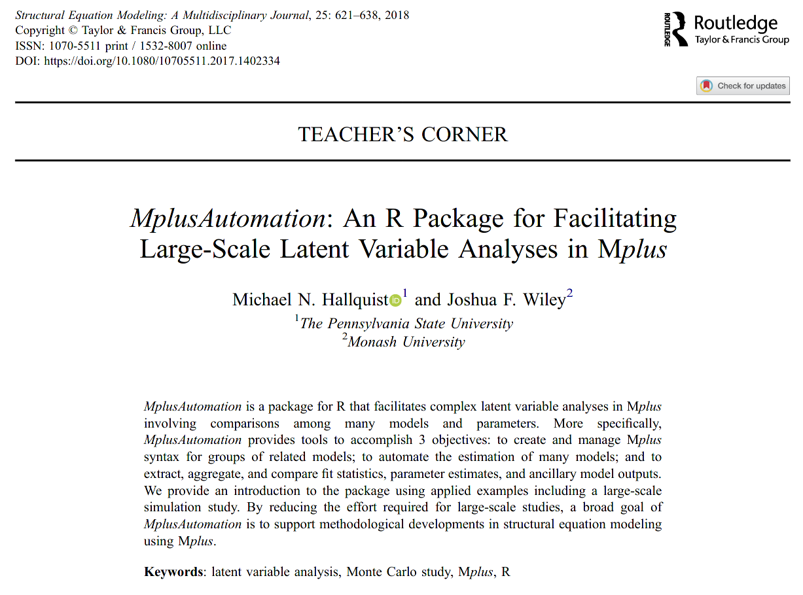
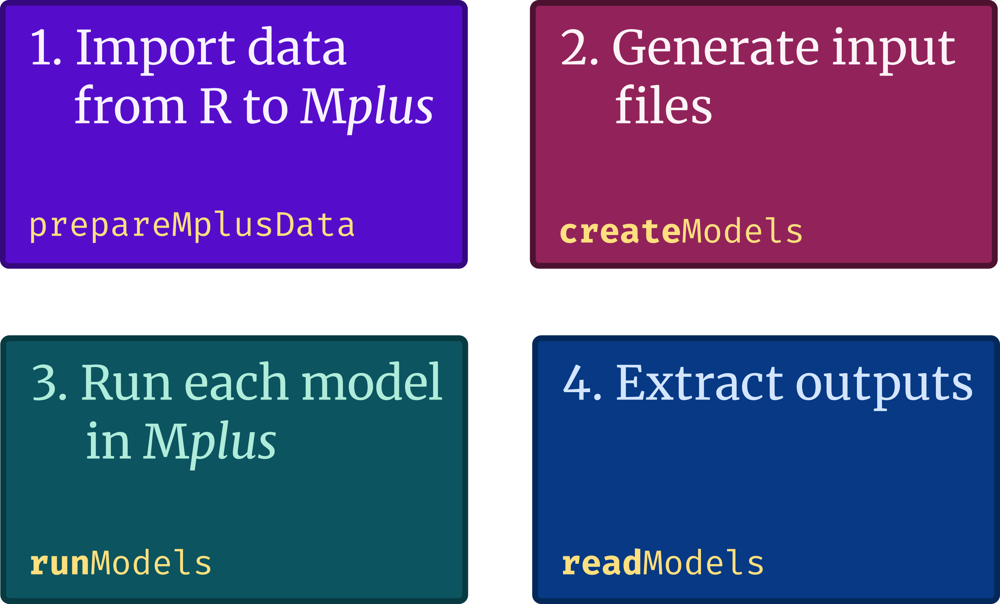
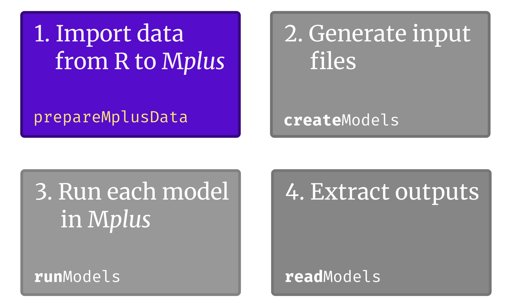
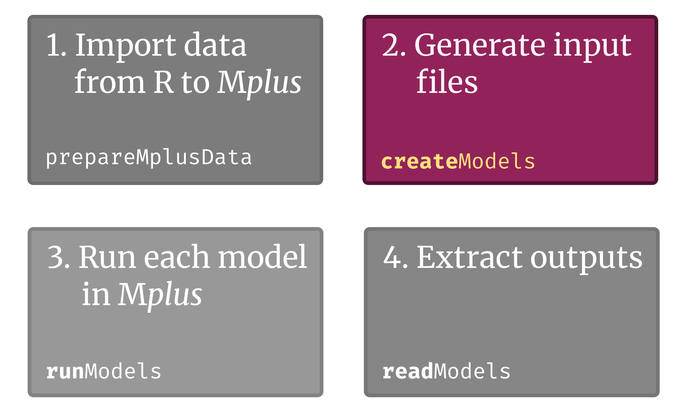
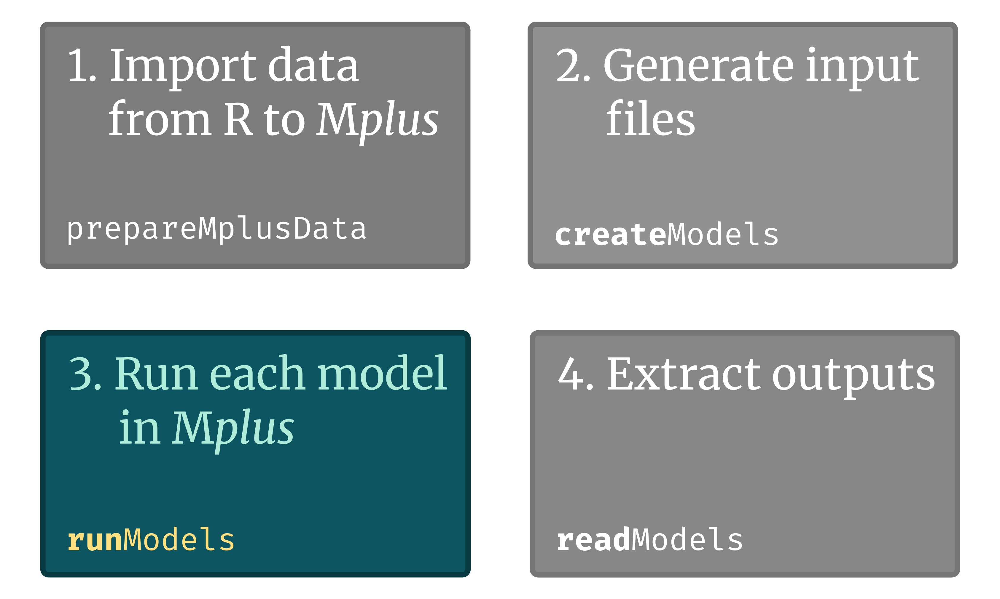
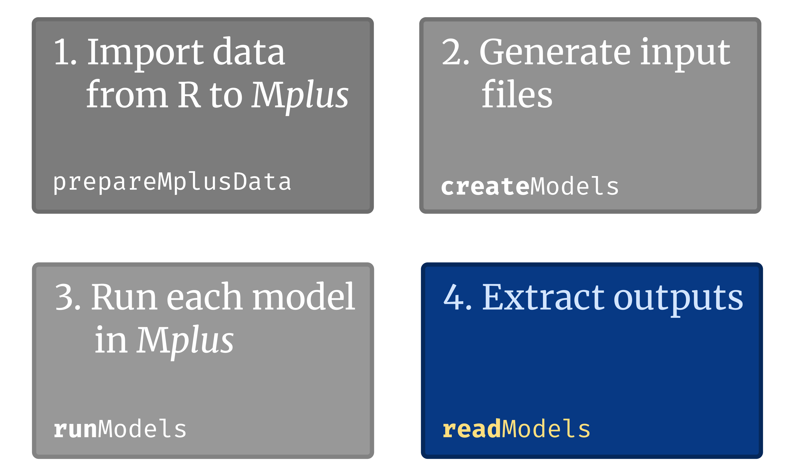

```{r xaringan-themer, include=FALSE, warning=FALSE}
library(xaringanthemer)
style_mono_accent(base_color = "#43418A",
                  text_font_google   = google_font("Merriweather", "400",
                                                   "400i"),
                  code_font_google   = google_font("Fira Mono"))


rinline <- function(code) {
  sprintf('``` `r %s` ```', code)
}

library(tidyverse)
library(knitr)
library(lubridate)
library(MplusAutomation)
library(haven)
library(here)
library(fs)
library(lavaan)
```

```{css, echo=F}
.code-bg-green .remark-code, .code-bg-red .remark-code * {
 background-color:#FFFDE0!important;
 .cod
}

.scroll-output {
  height: 90%;
  overflow-y: scroll;
}


.center-left {
  position:          relative;
  top:               50%;
  transform:         translateY(50%);
}

.center-right {
  position:          relative;
  top:               50%;
  transform:         translateY(10%);
}

.tiny{font-size: 50%}
.very-small{font-size: 60%}
```

# Three minute version `r emo::ji('clock')`


1. `MplusAutomation` is an R package that allows us to programatically interact
   with Mplus without leaving R `r emo::ji("raising hands")`

2. We can create input files (`.inp`), run them in Mplus, and extract the
   outputs.

3. This is great for  **reproducibility.**


### This talk

**Why?** The joys of Mplus `r emo::ji("person_facepalming")`, and the problem we're trying to solve.

**How?** What is `MplusAutomation`? How does it work?
* Formatting your data for Mplus
* Generating input files
* Extracting output

**Going further** `r emo::ji("rocket")` RMarkdown, `purrr` `r emo::ji("cat2")`, parallel processing, `lavaan`...

???

Who is this for?  
Anyone interested in fitting SEM models  
R users, future R users, Mplus users  
Obviously using R, but will hopefully be approachable to all  


---
class: middle, center


---
class: middle, center

.pull-left[
<br><br><br><br>
# Do we still need this? 
]
.pull-right[.center[]]


---
class: middle, center, inverse

## What is Mplus?
<br>
<br>
## What is is the problem we're trying to solve?

---
class: spaced
# The joys of using Mplus `r emo::ji("cry")`


.pull-left[
1. Write an input file.

2. Click `Run`.

3. Review the output file, all 20 pages... `r emo::ji("see_no_evil")`

4. Scroll down to the section of output you actually need.

5. Keep scrolling...

6. Copy the required outputs into a spreadsheet?

7. Reformat by hand.

8. Copy into your manuscript.

]

.pull-right[
.center[

.content-box-blue[
To reproduce your analysis, just repeat steps 1 to 8. `r emo::ji("laughing")`
]

]]

---

.content-box-blue[
This is bad enough for a single input file `r emo::ji("unamused")`. But some
applications require many input files.

* Simulation studies `r emo::ji("disappointed")`
* Latent class analysis  `r emo::ji("cry")`
* Tools that build on Mplus `r emo::ji("sob")`
]

--



---
class: middle

#### [Discernment of Mediator and Outcome Measurement in the PACE trial](https://www.medrxiv.org/content/10.1101/2021.01.25.21250436v1)

.pull-left[

.small[
*Ewan Carr, Silia Vitoratou, Trudie Chalder, and Kimberley Goldsmith*
]

<br><br><br><br><br><br>
<br><br>

.tiny[<https://www.medrxiv.org/content/10.1101/2021.01.25.21250436v1>]
]

.pull-right[.center[

 ]]


---
class: center
### `r emo::ji("mouse")` Reasons to avoid point-and-click analyses `r emo::ji("no_entry_sign")`

--

.center[
.pull-left[
### 1. Efficiency 

.tiny[<https://xkcd.com/1205/>]
]

.pull-right[
### 2. Reproducibility 

]
]

---
class: inverse, center, middle

# What is MplusAutomation?

---

`MplusAutomation` is an R package that talks to Mplus.

.content-box-yellow[.small[
MplusAutomation is a package for R that **facilitates complex latent variable
analyses in Mplus** involving comparisons among many models and parameters.

More specifically, MplusAutomation provides tools to accomplish **3 objectives**:

1. To **create and manage Mplus syntax** for groups of related models;
2. To **automate the estimation** of many models;
3. And to **extract**, aggregate, and compare fit statistics, parameter
   estimates, and ancillary model outputs. 


   ]]

.pull-left[

.small[
It's been around since 2010, regularly updated. To get started:

* Read the [paper](https://www.tandfonline.com/doi/full/10.1080/10705511.2017.1402334) and [vignette](https://cran.r-project.org/web/packages/MplusAutomation/vignettes/Vignette.pdf) `r emo::ji("green_book")`
* Take a look at the [GitHub page](https://github.com/michaelhallquist/MplusAutomation) and [forum](https://groups.google.com/forum/#!forum/mplusautomation) `r emo::ji("eyes")` 
* Keep listening! `r emo::ji("ear")` 

If you use it, cite it!   
.very-small[See `citation("MplusAutomation")`.]
]]

.pull-right[



]

---
## How does it work?



---
## Show me! `r emo::ji("thinking")`

.large[
```{r, message=FALSE, warning=FALSE, results='hide'}
library(MplusAutomation)
library(texreg)

# Specify the model
cfa <- "
        DATA:      FILE  = data/ex5.1.dat;
        VARIABLE:  NAMES = y1-y6;
                   USEVAR = y1-y3;
        MODEL:     f1 BY y1-y3;
        "

# Create the input file
writeLines(cfa, "cfa.inp")

# Run in Mplus
runModels("cfa.inp")

# Read the output file
fit <- readModels("cfa.out")
```
]

---

.pull-left[
```{r, results='hide'}
htmlreg(fit,
  summaries = c("Observations",
                "CFI",
                "SRMR"))
```
]

.pull-right[
```{r, results='asis', echo=FALSE}
htmlreg(fit,
        summaries = c("Observations",
                      "CFI",
                      "SRMR"),
        single.row=TRUE,
        ci.force = TRUE,
        ci.test = NULL,
        caption = "CFA, single factor",
        caption.above = TRUE)
```
]
    
---
## Again! `r emo::ji("star_struck")`

```{r, echo=TRUE, eval=FALSE}
map(`2:6`,
  ~ str_glue("DATA:      FILE         = ex7.3.dat;
              VARIABLE:  NAMES        = u1-u4 x1-x10;
                         USEVARIABLES = u1-u4;
                         CATEGORICAL  = u1-u4;
                         CLASSES     = c (`{.x}`);
                 ANALYSIS: TYPE = MIXTURE;") %>%
  write_lines(., str_glue("lca/`{.x}`class.inp")))

runModels("lca")
fit <- readModels("lca")
```

```{r, echo=FALSE, message=FALSE, results='hide'}
map(2:6,
    ~ str_glue("DATA:      FILE = ../../data/ex7.3.dat;
                VARIABLE:  NAMES ARE u1-u4 x1-x10;
                           USEVARIABLES = u1-u4;
                           CATEGORICAL = u1-u4;
                           CLASSES = c ({.x}); 
                 ANALYSIS: TYPE = MIXTURE;") %>%
      write_lines(., str_glue("input_files/lca/{.x}class.inp")))

runModels("input_files/lca")
fit <- readModels("input_files/lca")
```
.small[
```{r}
map_dfr(fit, "summaries") %>%
    select(NLatentClasses, Observations, AIC, aBIC, LL, Entropy) %>%
    kable()
```
]

---
class: spaced
The rest of this talk...

### Getting started

1. Getting data into Mplus
2. Generating input files
4. Running models 
3. Extracting and formatting output

### Going further

4. Running models in parallel with `furrr`
5. Summarising many models with `map`
5. What about `lavaan`?


### Q&A

---
# A brief interlude into R

(Sorry).

* `MplusAutomation` is great, but where possible I want to use generic
  functions. (I'd rather .deep-orange[learn something once] that can be applied
  everywhere).

* Much of what I'll talk about today builds on two R functions: `str_glue` and `map`.

.pull-left[ .center[  ]]
.pull-right[ .center[  ]]

---
# `r emo::ji("thread")` `str_glue`

`str_glue` does [string interpolation](https://en.wikipedia.org/wiki/String_interpolation).

```{r}
x <- 23

str_glue("The number is {x}.")
```

--

```{r}
today <- ymd("2021-03-16")

str_glue("Today is {wday(today, label = TRUE, abbr = FALSE)}.")
```

--

We can also provide a list (or vector) of inputs:

```{r}
str_glue("This is number {1:3}")
```


---
# `r emo::ji("japan")` `map`

`map` applies a function to a list.

```{r}
map_dbl(1:6, sqrt)
```

--

<br>
You can use an existing function (e.g. `sqrt`) or a temporary function:

```{r, eval=FALSE}
map_dbl(1:10, `~ .x^2`)
map_dbl(1:10, `function(x) { x^2 }`)    # These two lines are equivalent
```

```{r, echo=FALSE}
map_dbl(1:10, ~ .x^2)
```

---

# `r emo::ji("woman_walking")` `walk`


If you don't need the outputs, use `walk`:

```{r, eval=FALSE}
walk(list_of_things, some_function)
```

Useful where your function carries out some action (e.g. running a model in
Mplus) but where you don't need to store the result of this action.


<br><br><br><br><br><br><br><br><br>


.right[Back to `MplusAutomation`...]

---
class: middle, center




---
# `r emo::ji("floppy")` Getting data into Mplus

.pull-left[Mplus requires your data to be in a specific format.

I have .teal[no idea] what this is.  `r emo::ji("shrug")`
]

.pull-right[
.middle[
```{r, eval=FALSE}
DATA:        FILE = `ex3.1.dat`;
VARIABLE:    NAMES = y1 x1 x3;
MODEL:       y1 ON x1 x3;
```
]]


--

<br>
In the past, I've used `stata2mplus`. Now, `prepareMplusData`:

```{r, results='hide', warning=FALSE, message=FALSE}
# Load some data
data(HolzingerSwineford1939)

# Reformat for Mplus
prepareMplusData(HolzingerSwineford1939, "hs1939.dat")
```

--

There are a few options (see `?prepareMplusData` for details) — e.g. to
drop variables or only write data on changes.

```{r, eval=FALSE}
# Importing a Stata dataset
df <- read_dta("stata_dataset.dta")
prepareMplusData(df, "df.dat")
```

---

`r emo::ji("bulb")` `prepareMplusData` will also generate input files:

```{r, message=FALSE, warning=FALSE}
inp <- prepareMplusData(HolzingerSwineford1939, "hs1939.dat")
print(inp)
```

---
class: middle, center



---

# Generating input files

`MplusAutomation` provides the `createModels` function. I prefer to use generic
R functions instead (e.g. `str_glue` and `map`).

--

### Example 1: A static input file

```{r, eval=FALSE}
# Write your input file
inp <- "
TITLE:    this is an example of a simple linear
          regression for a continuous observed
          dependent variable with two covariates
DATA:     FILE IS ex3.1.dat;
VARIABLE: NAMES ARE y1 x1 x3;
MODEL:    y1 ON x1 x3;"

# Save it
writeLines(inp, "ex3_1.inp")

# Run it
runModels("ex3_1.inp")
```

---
### Example 2: A dynamic input file

What if we wanted to repeat this model for several outcomes?

```{r, eval=FALSE}
inp <- "DATA:     FILE IS ex3.1.dat;
        VARIABLE: NAMES ARE y1 y2 y3 x;
        MODEL:    `y1` ON x;"
```

--

We can use `str_glue` and `walk` for this:

```{r, eval=FALSE}
walk(c("y1", "y2", "y3"), function(x) {
         # Generate the input file for this outcome
         input_file <- str_glue("DATA:     FILE IS ex3.1.dat;
                                 VARIABLE: NAMES ARE y1 y2 y3 x;
                                 MODEL:    `{x}` ON x;")
         # Save
         writeLines(input_file, paste0(`x`, ".inp")) })
```

--

.pull-left[
`y1.inp`
.code-bg-green[
```bash
DATA:     FILE IS ex3.1.dat;
VARIABLE: NAMES ARE y1 y2 y3 x;
MODEL:    y1 ON x;
```
]]

.pull-right[
`y2.inp`
.code-bg-green[
```bash
DATA:     FILE IS ex3.1.dat;
VARIABLE: NAMES ARE y1 y2 y3 x;
MODEL:    y2 ON x;
```
]]

---
class: spacing
### Example 3: Another dynamic example

Suppose we wanted to fit a latent class model with between 2 and 8 classes.

```{r, echo=1}
n_classes <- 2:8
cat(n_classes)
```

```{r, eval=FALSE}
walk(`n_classes`, function(x) {
         input_file <- str_glue("DATA:       FILE = ex4.4.dat;
                                 VARIABLE:   NAMES = y1-y8;
                                 CLASSES =   c(`{x}`);
                                 ANALYSIS:   TYPE = MIXTURE;")
         writeLines(input_file, str_glue("lca_`{x}`.inp")) })
```


--

.content-box-blue[
This process can be summarised as:

1. Make a **list of inputs** (e.g. dependent variables, numbers of classes)  
2. Update the model using **placeholders**.

This can be as simple `r emo::ji("smiley")` or complex `r emo::ji("frowning")` as you need.
]

---

Suppose we want to fit this latent class model to 100 datasets `r emo::ji("scream")`.

```{r, eval=TRUE}
datasets <- dir_ls("data", glob = "d*.dat")
n_classes <- 2:8 
```

And maybe, consider two predictors of class membership, `x1` and `x2`.

```{r}
predictors <- c("x1", "x2")
```
--

We can produce list containing **all combinations** of these input parameters with `cross`:

```{r}
all_combinations <- cross(list(d = datasets,
                               nc = n_classes,
                               p = predictors))
```

This produces a list with 7 $\times$ 2 $\times$ 100 = 1400 items.

---

.pull-left[

Here's the first item:

```{r}
all_combinations[[1]]
```

And the 90<sup><small>th</small></sup> item:

```{r}
all_combinations[[90]]
```
]

.pull-right[
Here's the second item: 

```{r}
all_combinations[[2]]
```


<br>


.content-box-green[
Note that the parameters inside each item are
labelled:

`d` refers to the dataset  

`nc` refers to the number of classes  

`p` refers to the predictors
]
]

---

We can then use these in our placeholders:

```{r, eval=FALSE}
walk(all_combinations, function(x) {
         input_file <- str_glue("
                 DATA:     FILE      = {`x$d`};
                 VARIABLE: NAMES     = u1-u4 x1 x2;
                           CLASSES   = c ({`x$nc`});
                 ANALYSIS: TYPE      = MIXTURE;
                           ALGORITHM = INTEGRATION;
                 MODEL:    %OVERALL%
                           c ON {`x$p`};
                           %c#1%
                           [u1$1-u4$1];
                           %c#2%
                           [u1$1-u4$1];
                 OUTPUT:   TECH1 TECH8;")
         # Generate a filename and save
         fn <- str_glue("{path_ext_remove(path_file(x$d))}_{nc}_{p}.inp")
         writeLines(input_file, fn)
}
```

This will generate 1400 input files, e.g.

```
dataset1_2_x1.inp
dataset1_3_x1.inp
dataset1_4_x1.inp
dataset1_5_x1.inp
...
```

---
class: middle, center



---

# Run models with `runModels`

.pull-left[
**1)** You can run a single model:

```{r, eval=FALSE}
runModels("cfa.inp")
```

<br>
**3)** You can print outputs:

```{r, eval=FALSE}
runModels("cfa.inp",
          showOutput=TRUE)
```
]


.pull-right[

**2)** Or a folder of models:

```{r, eval=FALSE}
runModels("a_folder_of_models")
```

<br><br>
```
##
## Running model: cfa.inp
## System command: "mplus" "cfa.inp"
## 
##      Mplus VERSION 8.4 (Linux)
##      MUTHEN & MUTHEN
## 
##      Running input file 'cfa.inp'...
## 
##      Beginning Time:  18:57:53
##         Ending Time:  18:57:53
##        Elapsed Time:  00:00:00
## 
##      Output saved in 'cfa.out'.
```
]


---

A few points:

* `runModels` will try and guess where Mplus is installed. 
* You can optionally specify `filefilter` to run a subset models.

If you're fitting many models, `walk` may be more robust:

```{r, eval=FALSE}
# Create a list of input files
to_run <- dir_ls("models", glob = "*.inp")

# Pass each file to runModels
walk(to_run, runModels)
```

(This also brings other benefits, like easy parallelization, as we'll see
later).


---
class: center, middle



---
# Parse outputs with .small[`readModels`]

.center[

]

---

```
Mplus VERSION 8.4 (Linux)
MUTHEN & MUTHEN
03/16/2021  03:00 PM

INPUT INSTRUCTIONS

  DATA:   FILE  = ../data/ex5.1.dat;
          VARIABLE:  NAMES = y1-y6;
                     USEVAR = y1-y3;
          MODEL:     f1 BY y1-y3;


INPUT READING TERMINATED NORMALLY


SUMMARY OF ANALYSIS

Number of groups                                                 1
Number of observations                                         500

Number of dependent variables                                    3
Number of independent variables                                  0
Number of continuous latent variables                            1

Observed dependent variables

  Continuous
   Y1          Y2          Y3

Continuous latent variables
   F1
```

---

```
Estimator                                                       ML
Information matrix                                        OBSERVED
Maximum number of iterations                                  1000
Convergence criterion                                    0.500D-04
Maximum number of steepest descent iterations                   20

Input data file(s)
  ../data/ex5.1.dat

Input data format  FREE


UNIVARIATE SAMPLE STATISTICS


     UNIVARIATE HIGHER-ORDER MOMENT DESCRIPTIVE STATISTICS

         Variable/         Mean/     Skewness/   Minimum/ % with                Percentiles
        Sample Size      Variance    Kurtosis    Maximum  Min/Max      20%/60%    40%/80%    Median

     Y1                   -0.022      -0.050      -3.958    0.20%      -1.236     -0.395     -0.039
             500.000       1.971      -0.363       3.588    0.20%       0.328      1.240
     Y2                    0.026      -0.139      -5.193    0.20%      -1.096     -0.321      0.044
             500.000       1.949       0.107       3.703    0.20%       0.385      1.211
     Y3                    0.035       0.169      -3.907    0.20%      -1.138     -0.398     -0.060
             500.000       1.953      -0.135       4.159    0.20%       0.303      1.173


THE MODEL ESTIMATION TERMINATED NORMALLY
```

---


```
MODEL FIT INFORMATION

Number of Free Parameters                        9

Loglikelihood

          H0 Value                       -2450.381
          H1 Value                       -2450.381

Information Criteria

          Akaike (AIC)                    4918.763
          Bayesian (BIC)                  4956.694
          Sample-Size Adjusted BIC        4928.128
            (n* = (n + 2) / 24)

Chi-Square Test of Model Fit

          Value                              0.000
          Degrees of Freedom                     0
          P-Value                           0.0000

RMSEA (Root Mean Square Error Of Approximation)

          Estimate                           0.000
          90 Percent C.I.                    0.000  0.000
          Probability RMSEA <= .05           0.000

CFI/TLI

          CFI                                1.000
          TLI                                1.000

Chi-Square Test of Model Fit for the Baseline Model

          Value                            363.624
          Degrees of Freedom                     3
          P-Value                           0.0000

SRMR (Standardized Root Mean Square Residual)

          Value                              0.000
```


---

```
MODEL RESULTS

                                                    Two-Tailed
                    Estimate       S.E.  Est./S.E.    P-Value

 F1       BY
    Y1                 1.000      0.000    999.000    999.000
    Y2                 1.125      0.099     11.378      0.000
    Y3                 1.020      0.089     11.474      0.000

 Intercepts
    Y1                -0.022      0.063     -0.354      0.723
    Y2                 0.026      0.062      0.410      0.682
    Y3                 0.035      0.062      0.555      0.579

 Variances
    F1                 0.908      0.125      7.257      0.000

 Residual Variances
    Y1                 1.063      0.096     11.114      0.000
    Y2                 0.799      0.100      8.002      0.000
    Y3                 1.009      0.095     10.586      0.000
```


---

```
QUALITY OF NUMERICAL RESULTS

     Condition Number for the Information Matrix              0.595E-01
       (ratio of smallest to largest eigenvalue)


     Beginning Time:  12:05:35
        Ending Time:  12:05:35
       Elapsed Time:  00:00:00


MUTHEN & MUTHEN
3463 Stoner Ave.
Los Angeles, CA  90066

Tel: (310) 391-9971
Fax: (310) 391-8971
Web: www.StatModel.com
Support: Support@StatModel.com

Copyright (c) 1998-2019 Muthen & Muthen
```

---

## `readModels`

`readModels` can take a single output file:

```{r, echo=FALSE, results='hide'}
runModels("input_files/ex6.11.inp")
```

```{r, results="hide"}
output <- readModels("input_files/ex6.11.out")
```

Or an entire folder:

```{r, results="hide"}
all_outputs <- readModels("input_files")
```

We get back a list containing different elements of the output:

```{r}
names(output)
```

---

This can be a little daunting:

```{r}
str(output)
```

---

But note that each section is labelled:

```{r}
names(output)
```

So we can explore each in turn. Here's the sample statistics:

```{r}
output$sampstat
```

---

Here are the model parameters:

```{r}
output$parameters
```

---

`summaries` is a data frame containing model fit indices:

```{r}
names(output$summaries)
```

We can access individual items with `$`:

.pull-left[
```{r}
output$summaries$Observations
```

```{r}
output$summaries$AIC
```

]
.pull-right[

```{r}
output$summaries$ChiSqM_Value
```

```{r}
output$summaries$Filename
```
]


---

You can use these estimates directly in RMarkdown documents. 

For example, this text:

```{r, echo=FALSE}
fit <- output$summaries
```

<code>
```
 The model included \`r '\x60r fit$Observations\x60'` participants.
 The AIC and BIC were \`r '\x60r fit$AIC\x60'` and \`r '\x60r fit$BIC\x60'`, respectively. 
```
</code>

Would become:

<code>
 The model included `r fit$Observations` participants. The AIC and BIC were
 `r fit$AIC` and `r fit$BIC`, respectively.
</code>

---

## Using `texreg` to produce tables


The `texreg` package can take Mplus output from `readModels` and produce regression tables:

.pull-left[
```{r, eval=FALSE}
library(texreg)
cfa <- readModels("cfa.out")
screenreg(cfa,
          single.row = TRUE,
          ci.force = TRUE,
          ci.test = NA,
          stars = 0)
```

<br>
<br>

Use `screenreg` for console output, `texreg` for LaTeX, `htmlreg` for HTML.

Read more [here](https://cran.r-project.org/web/packages/texreg/vignettes/texreg.pdf).

]

.pull-right[

```{r, echo=FALSE}
library(texreg)
cfa <- readModels("cfa.out")
screenreg(cfa,
          single.row = TRUE,
          ci.force = TRUE,
          ci.test = NA,
          stars = 0)
```

]


---
class: middle, center, inverse

# Going further...


---

# Running models in parallel

Mplus can make use of multiple CPU cores with the `PROCESSORS` option.

But sometimes we'd rather run **many instances of Mplus in parallel** (rather
than a single instance using multiple cores).

For example, a model that doesn't benefit from increasing `PROCESSORS` but that
we need to run 1000 times.

For this, we can use `furrr`:

.pull-left[
```{r, eval=FALSE}
install.packages("furrr")
library(furrr)
```

`furrr` provides parallel equivalents to `map` and `walk`, all starting with the `future_` prefix:

* `future_map`
* `future_walk`

]

.pull-right[ .center[  ]]

---

## Example using `furrr`

We saw earlier how we could use `walk` and `runModels` to run all input files
in a directory:

```{r, eval=FALSE}
# Create a list containing the paths of the input files
all_models <- dir_ls("models", glob = "*.inp")

# Repeatedly run Mplus for each input file in the list
walk(all_models, runMplus)
```

This will happen sequentially `r emo::ji("zzz")`. To run this in parallel `r 
emo::ji("rocket")`:

```{r, eval=FALSE}
# Load library, specify number of CPU cores to use
library(furrr)
plan(multisession, workers = 24)

# Run in parallel
future_walk(all_models, runMplus)
```

---

## Summarising many models with `map`

`readModels` returns a list containing different part of an output
file. For a single model, we can access the required statistics directly:

```{r, eval=FALSE}
output$summaries$AIC
```

To summarise many models, `map` can help. 

--

```{r, eval=FALSE}
# First, run models in Mplus for 2-8 latent classes:
walk(dir_ls("input_files", regexp = "lca_.*inp"), runModels)
```


```{r, eval = TRUE}
# Then import each output file into R:
fit <- readModels("input_files", filefilter = "lca_.*")
```

---

We now have a list (`fit`) containing each model. For example, here's the first
model:

```{r}
fit[[1]]
```

We can access specific elements manually:

```{r}
fit[[1]]$summaries$AIC
```

But this doesn't scale well.


---

Instead, we can use `map`:

```{r}
model_fit <- map_dfr(fit,
                     ~ select(.x$summaries,
                              Classes = NLatentClasses,
                              AIC, aBIC, LL))
```

.small[`r emo::ji("thinking")` For each model, select the "summaries" element, and from this, select the
required columns. Then combine all the models into single data frame.]

.pull-left[.small[

```{r, dpi=300, fig.height=2.5, fig.width=4}
ggplot(model_fit, 
       aes(x = Classes, y = aBIC)) +
    geom_point() +
    geom_line()
```
]]


.pull-right[.small[
```{r}
kable(model_fit)
```
]]


---
# What about `lavaan`?

.pull-left[
1. Sometimes, you just need Mplus.

2. Most of what we've covered (`str_glue`, `map`, `walk`) can be applied to
   `lavaan`.

   `tidy` from the `broom` package takes the place of `readModels`.
]

.pull-right[

]

---

```{r, echo=FALSE}
set.seed(1234)
X <- rnorm(100)
M1 <- 0.2*X + rnorm(100)
M2 <- 0.5*X + rnorm(100)
M3 <- 0.5*X + rnorm(100)
Y <- 0.7*M1 + 0.2*M2 + 0.5*M3 + rnorm(100)
dat <- data.frame(X = X,
                  Y = Y,
                  M1 = M1,
                  M2 = M2,
                  M3 = M3)
```

.small[
```{r}
library(lavaan)
library(broom)

mediators <- c("M1", "M2", "M3")
fit <- map(mediators, function(m) {
        model <- str_glue("# direct effect
                             Y ~ c*X
                           # mediator
                             {m} ~ a*X
                             Y ~ b*{m}
                           # indirect effect (a*b)
                             ab := a*b
                           # total effect
                             total := c + (a*b)")
        return(sem(model, data = dat)) })
names(fit) <- mediators
```
]

.pull-left[
.small[
```{r, eval=FALSE}
fit %>%
    map_dfr(tidy,
            .id = "mediator") %>%
    filter(label %in% c("ab",
                        "total")) %>%
    select(mediator,
           label,
           estimate,
           std.error) %>%
    kable()
```
]]


.pull-right[
.small[
```{r, echo=FALSE}
fit %>%
    map_dfr(tidy, .id = "mediator") %>%
    filter(label %in% c("ab", "total")) %>%
    select(mediator, label, estimate, std.error) %>%
    kable()
```
]]


---
class: inverse, middle, center

# Wrapping up...

---
# Summary

.large[
1. Removing manual steps from our analyses is good for efficiency and
   reproducibility.

2. MplusAutomation offers tools to fit models in Mplus and 
   import the fitted model into R.

   .small[(They've done the hard work so you don't have to `r emo::ji("folded_hands")`).]

3. This can be combined with `purrr` to flexibly generate, fit, and summarise
   Mplus models.

4. This workflow can be applied to `lavann` (and any other packages where
   models are specified in plain text).
]

---
## Things we didn't have time to cover 

.large[
1. A complete example in RMarkdown

2. What happens if `readModels` doesn't extract what you want?

3. Running Mplus on a computing cluster, like Rosalind
]


---
class: inverse, center, middle

# Thanks for listening `r emo::ji("smiley")`
<br>
<br>
# Questions? `r emo::ji("raising_hand")`

---
class:middle, center

*Slides created with [xaringan](https://slides.yihui.org/xaringan/).*
<br>

*emojis supplied by [`library(emo)`](https://github.com/hadley/emo).*
